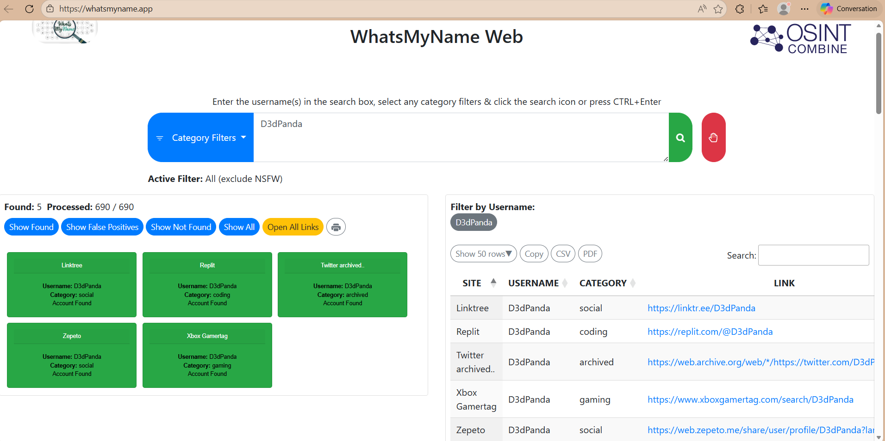
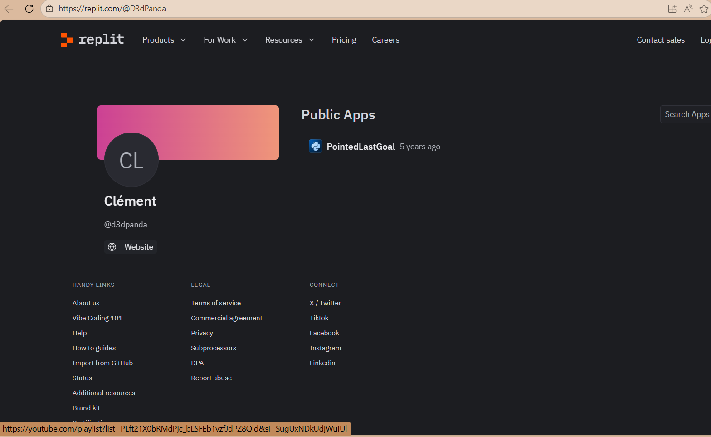
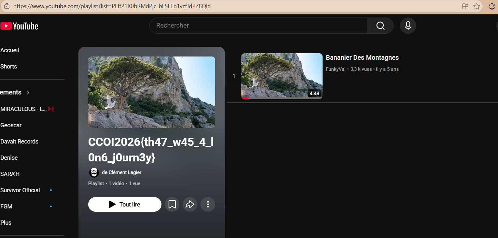

Writeups – WHO IS THIS GUY

Nom à rechercher : d3dpanda

J’ai commencé par effectuer une recherche du pseudo sur le site https://whatsmyname.app/
, ce qui m’a permis d’obtenir plusieurs profils associés à ce nom.

J’ai ensuite consulté les résultats dans l’ordre décroissant.
Le premier lien, https://linktr.ee/D3dPanda, redirige vers un compte GitHub : https://github.com/D3DPanda-C
. Cependant, la page affiche “Not Found”.

Je suis alors revenu aux résultats précédents et j’ai ouvert le profil Replit : https://replit.com/@D3dPanda
. Celui-ci mène au profil d’un certain Mr Clement (CL).

Sur cette page, un lien “website” est indiqué. Il redirige vers une playlist YouTube :
https://www.youtube.com/playlist?list=PLft21X0bRMdPjc_bLSFEb1vzfJdPZ8Qld

En consultant cette playlist, on remarque que le titre contient le nom “Clément Lagier”, et le flag est directement visible dans le titre.

le flag est `CCOI2026{th47_w45_4_l0n6_j0urn3y}`

