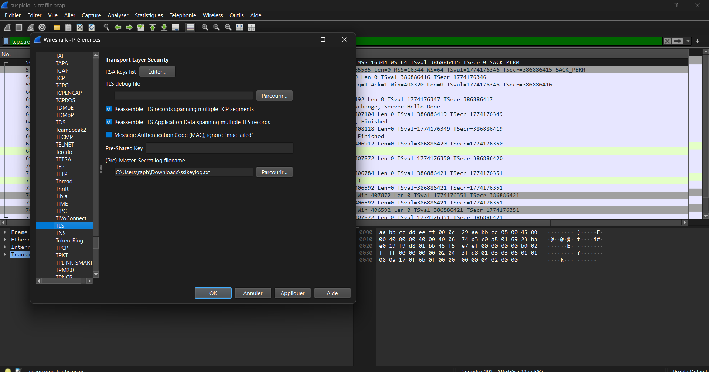
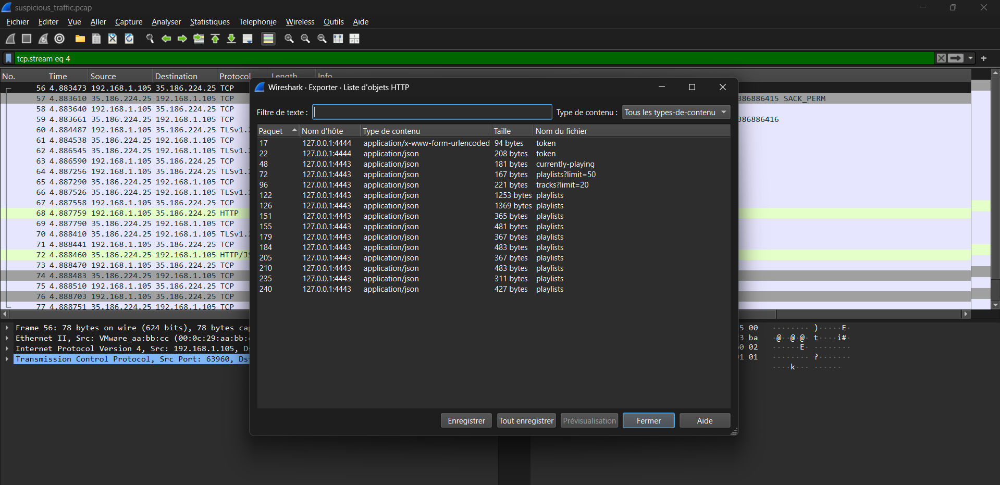
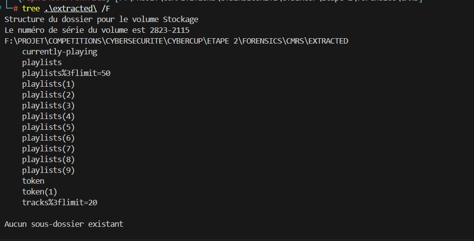
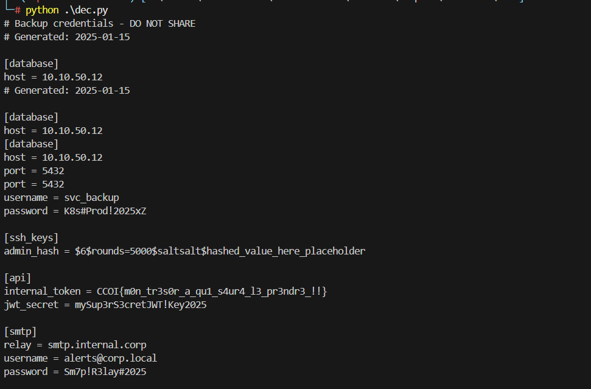

# Writeup – CMRS

## Fichiers fournis

- `suspicious_traffic.pcap` — capture réseau
- `sslkeylog.txt` — clés TLS pré-maître

---

## Étape 1 : Déchiffrer le trafic TLS avec Wireshark

Le trafic capturé est chiffré (HTTPS), donc illisible à première vue. Mais on dispose du fichier `sslkeylog.txt` qui contient les clés de session TLS.

Dans Wireshark : **Edit → Preferences → Protocols → TLS**, on renseigne le fichier dans le champ **(Pre)-Master-Secret log filename**. On recharge la capture, et le trafic HTTPS devient lisible en clair.


On remarque immédiatement une série de requêtes HTTP vers l'**API Spotify** (`api.spotify.com`).

---

## Étape 2 : Extraire les objets HTTP

Pour récupérer les réponses facilement : **File → Export Objects → HTTP**. Wireshark extrait automatiquement tous les objets, ce qui donne une quinzaine de fichiers dans le dossier `extracted/` :


```
currently-playing, playlists, playlists(1)...(9),
token, token(1), tracks%3flimit=20, playlists%3flimit=50
```


---

## Étape 3 : Analyser les fichiers extraits

En parcourant les fichiers JSON extraits, on identifie plusieurs éléments intéressants.

Un compte Spotify appartenant à `levasseur_974` (Olivier L.) a créé des playlists privées avec des noms suspects :

- `Mon tresor a qui saura le prendre`
- `inpayloadwetrust0`
- `inpayloadwetrust300`
- `inpayloadwetrust600`
- `inpayloadwetrust900`

Chaque playlist possède une **description encodée**. La playlist `Mon tresor...` a une description en **hexadécimal**, les autres ont des descriptions avec des **codes de 2 caractères** répétitifs (`a1`, `b3`, `h7`...).

---

## Étape 4 : Décoder la table de substitution

La description hexadécimale de `Mon tresor...` se décode trivialement :

```python
bytes.fromhex(hex_desc).decode('utf-8')
```

On obtient un JSON qui mappe chaque caractère de l'alphabet base64 vers un code custom :

```json
{"A": "a1", "B": "a2", "C": "a3", "D": "b1", ..., "+": "j1", "/": "j2", "=": "j3"}
```

C'est la **clé de substitution**. L'attaquant a remplacé chaque caractère base64 par un token de 2 lettres pour masquer ses données exfiltrées.

---

## Étape 5 : Décoder les payloads

Les suffixes numériques des playlists (0, 300, 600, 900) indiquent l'**ordre de reconstitution** des chunks. On inverse la table de substitution puis on décode chaque chunk dans l'ordre :

[dec.py](./dec.py)

---

## Étape 6 : Flag

Le base64 reconstruit décode vers un fichier de credentials complet — manifestement exfiltré par l'attaquant :



le flag finale est: `CCOI{m0n_tr3s0r_a_qu1_s4ur4_l3_pr3ndr3_!!}`