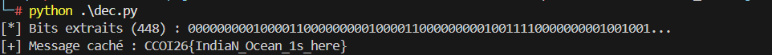

# Writeup – Unknown

## Première observation

En ouvrant le fichier `challengefile-toprovide.pdf`, on remarque immédiatement que l'extension est trompeuse. En lisant le contenu brut avec `cat`, on voit clairement un header RTF :

```
{\rtf1\fbidis\ansi\ansicpg1252...
```

Le fichier n'est pas un PDF, c'est un **document RTF**. Le nom du challenge, *"unknown"*, nous invite justement à ne pas se fier à l'extension et à identifier le vrai format.

---


## Ce qu'on voit dans le fichier

Le texte visible est banal : *"I am zero. please find me where I am."* — une phrase qui ressemble elle-même à un indice.

Mais entre chaque mot se cachent des séquences `\uXXXX?`, des caractères Unicode invisibles à l'œil nu. Ce sont des **zero-width characters** : des caractères qui n'affichent rien mais qui sont bien là dans les données.

---

## La stéganographie

On identifie 4 caractères invisibles récurrents :

`\u8204?` => `00`
`\u8205?` => `01`
`\u8236?` => `10`
`\u-257?` => `11`

4 symboles distincts = 2 bits chacun. Le message est encodé en binaire, disséminé entre les mots du texte visible.

---

## Extraction

On écrit un script Python pour :
1. Extraire tous les codes unicode du RTF avec une regex
2. Les convertir en bits selon le tableau ci-dessus
3. Regrouper par 8 bits et convertir en ASCII

[dec.py](./dec.py)


---

## Flag

```
CCOI26{IndiaN_Ocean_1s_here}
```
