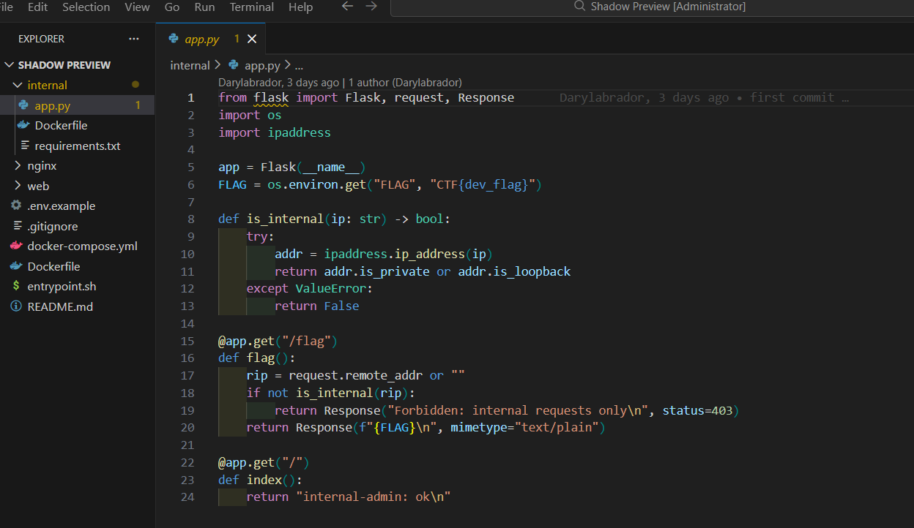
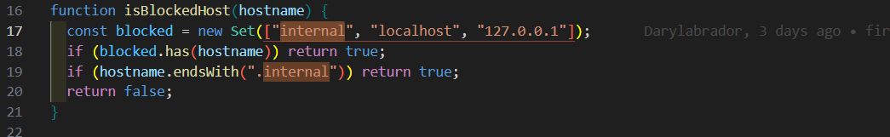
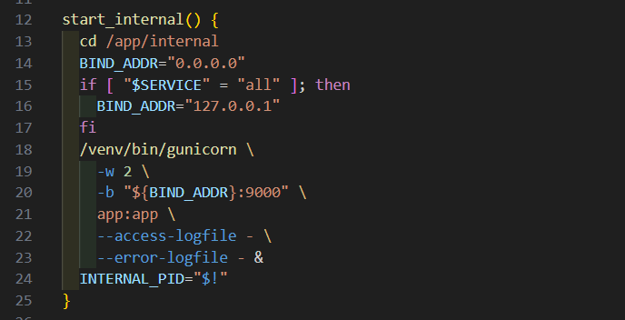
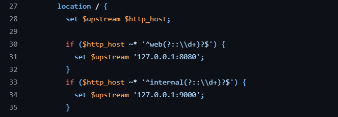
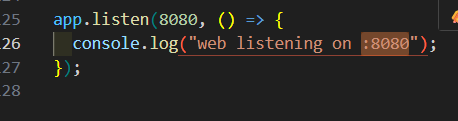
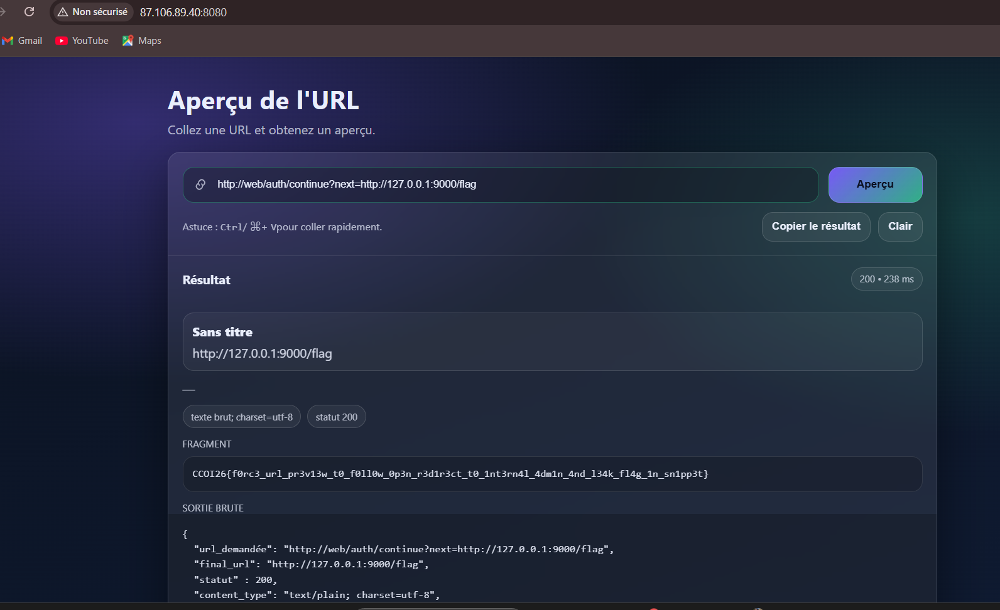

# WRITEUPS CHALLENGE SHADOW PREVIEW

Le sujet nous donne le lien GitHub de l’application Shadow Preview :
[github shadow preview](./images/https://github.com/Darylabrador/CTF-Challs/tree/main/web/Shadow%20Preview)

Le site permet de coller une URL pour en obtenir un aperçu. L’objectif est de récupérer le flag présent dans le service interne.

---

Dans le dossier `internal`, en regardant le fichier `app.py`, on voit qu’il existe une route `/flag` qui affiche le flag, mais uniquement en local. C’est donc clairement la cible.



---

Ensuite, en analysant le code principal, on remarque qu’il y a une restriction sur certains hôtes : `internal`, `localhost`, `127.0.0.1`.



Cela signifie qu’on ne peut pas appeler directement :

```
http://127.0.0.1:9000/flag
```

ou

```
http://internal:9000/flag
```

---

Dans `entrypoint.sh`, on voit que l’application interne est lancée sur le port 9000 sur l'addresse d'ecoute qui peut etre `127.0.0.1` ou `0.0.0.0`.



Donc la route cible devient :

```
http://127.0.0.1:9000/flag
```

Mais elle est bloquée par le filtre.

---

En regardant la configuration nginx, on remarque qu’il autorise le host `web` et redirige selon le Host header vers `127.0.0.1:8080`.



et dans `index.js`, on remarque que l'application web est egalement lancé sur le port `8080`.



On comprend alors que nginx route vers les services internes selon la valeur du Host.

---

Dans `index.js`, on voit la route suivante :


La route `/auth/continue` prend un paramètre `next` et renvoie un code 302 vers cette valeur, sans vérification.
Cela signifie qu’on peut forcer une redirection vers une URL interne.

L’idée est donc :

1. Utiliser un host autorisé (`web`)
2. Passer par `/auth/continue`
3. Mettre l’URL interne dans `next`

---

J’ai donc injecté ceci dans le paramètre du moteur de recherche :

```
http://web/auth/continue?next=http://127.0.0.1:9000/flag
```



La première URL est autorisée (`web`), puis l’application suit la redirection vers l’URL interne, ce qui permet de contourner le filtre initial.

---

Le flag final est donc :

```
CCOI26{f0rc3_url_pr3v13w_t0_f0ll0w_0p3n_r3d1r3ct_t0_1nt3rn4l_4dm1n_4nd_l34k_fl4g_1n_sn1pp3t}
```
