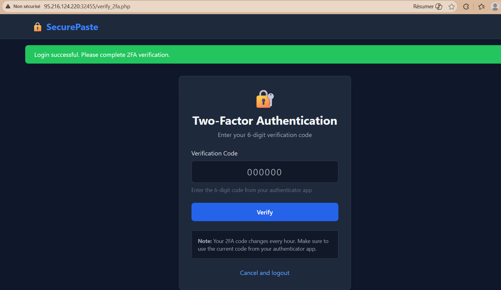
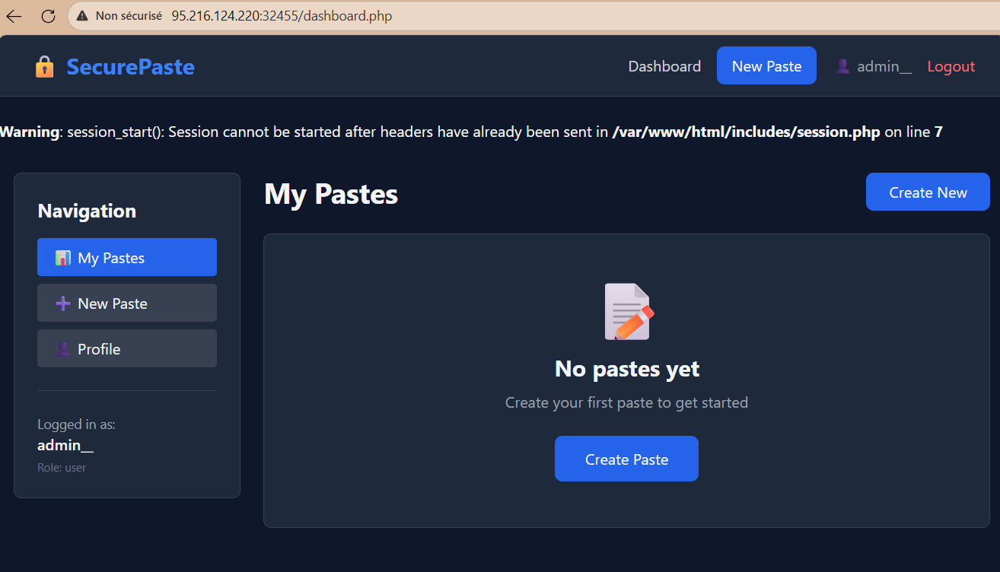
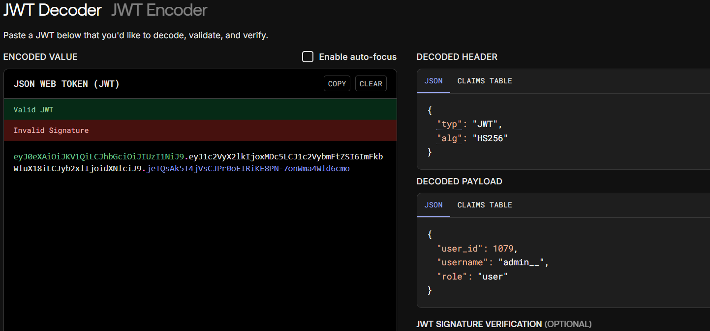
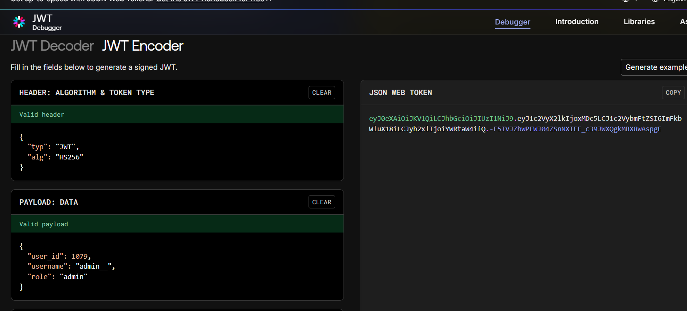
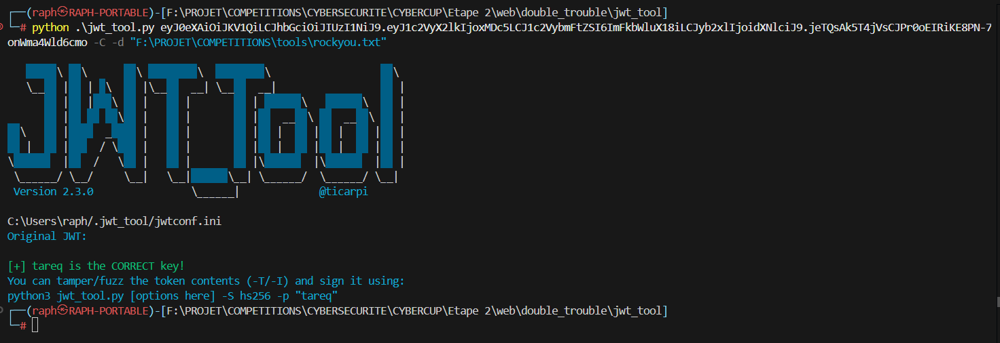
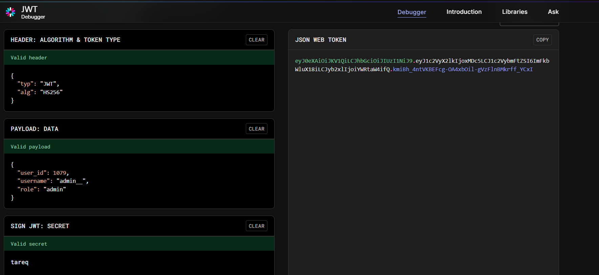
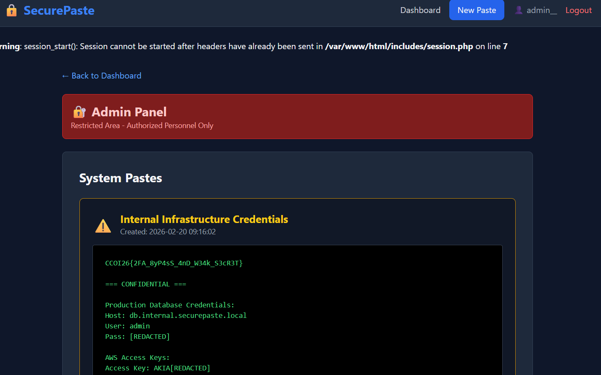

# Writeup – Double Trouble
**Catégorie :** Web · **Difficulté :** Moyen · **Points :** 200

> SecurePaste added two-factor authentication for enhanced security. They seem confident in their implementation. Can you find the weak links in their security chain?
> http://95.216.124.220:32455/

---

## Étape 1 : Bypass du 2FA

On commence par créer un compte et se connecter sur le site. Après une authentification réussie, le site redirige normalement vers une page de vérification OTP avant d'accéder au contenu.



Plutôt que de chercher à contourner le code OTP directement, on tente d'accéder manuellement aux endpoints de l'application — `dashboard.php`, `profile.php` — sans avoir complété la vérification. Et contre toute attente, l'accès au dashboard est accordé sans passer par le 2FA.



La vérification OTP n'est donc qu'une contrainte côté client : elle n'est pas appliquée côté serveur sur les routes protégées. Premier bug trouvé.

---

## Étape 2 : Analyse du JWT

Une fois dans le dashboard, on inspecte le cookie `auth_token`. Il s'agit d'un **JWT** dont le payload révèle un champ `role` avec la valeur `user`.



On modifie le payload pour passer `role` à `admin`, puis on met à jour le cookie dans le navigateur.



Le site refuse l'accès et redirige vers la page de connexion. Le token est signé — la modification a invalidé la signature. Il faut donc récupérer le secret de signature.

---

## Étape 3 : Crack du secret JWT

On utilise [jwt_tool](https://github.com/ticarpi/jwt_tool.git) pour tenter une attaque par dictionnaire sur la signature du JWT.



Le secret est trouvé : **`tareq`**. Avec ce secret en main, on reforge un JWT valide en fixant `role` à `admin` et on le signe correctement.



---

## Étape 4 : Accès admin et flag

On remplace le cookie `auth_token` par le JWT forgé. Le site accepte cette fois le token et déverrouille un panneau d'administration qui contient directement le flag.



---

## Flag

```
CCOI26{2FA_8yP4sS_4nD_W34k_S3cR3T}
```

---
