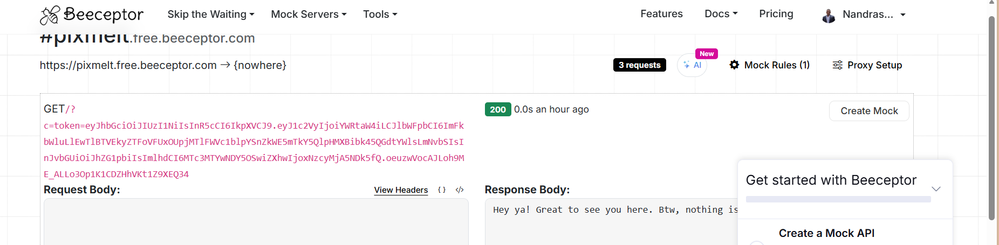
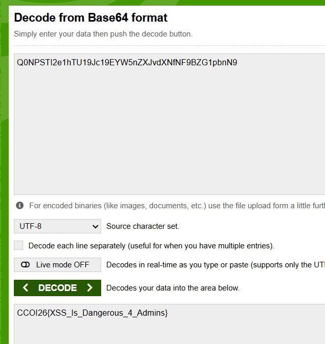

sur le site pixmelt, je me suis inscrit en tant que admin, admin@gmail.com, mais en decondant le jwt dans le cookie, on voit que le role est encore user, et dans le script.js dans le reseau, on constate qu'il y aun priviliege speciale pour admin sur la page en affichant un boutton edit profile, alors, j'ai modifié le role en admin et reencoder le jwt, puis changer le cookie, et vue que la client ne verifie pas la signature mais juste de role, le token fonctionne, puis le boutton edit profile affiche.
 on voit clairement dans l'ajout de formulaire qu'il y a une faille xss vue qu'il y a une ajout de div pour les nouveau commentaire, et pareil sur la modification de profile, car le test  , fonctionne très bien, 
 alors , j'ai aussi remarqué que le contenu est quand meme envoyé au backend et le commentaire se reload à chaque minute,

 finalement, je pense qu'il s'agit d'un vol de cookie, alors , j'ai crée un mock serveur dans beeceptor, et injectant le code malveillant dans un nouveau commentaire,

mais après une longue attente, ca ne fonctionnait pas, peut etre qu'il y avait un filtre, j'ai persister et changer mon script malveillant, car je pensait qu'il devrait avoir un bot admin qui cheque les commentaire regulirement et que je n'ai pas eu le bon taiming,

j'ai injecté:

et j'ai attendue, puis un requete arrive sans PHPSession dans le cookie,

 j'ai l'ai tout de suite décodé 

et j'ai décodé le base 64 dans l'email:

le flag finale est `CCOI26{XSS_Is_Dangerous_4_Admins}`